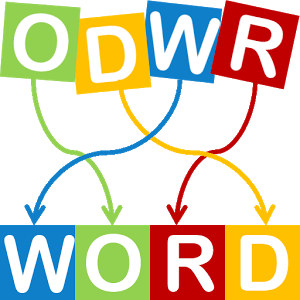

# AndroidAnagramGame

Anagrams (also known as Pirate Scrabble, Anagram, Snatch, Word Making and Taking and Grabscrab) is a tile-based word game that involves rearranging letter tiles to form words.
The game pieces consist of a set of tiles with letters on them. Tiles are turned over one by one, and players form words by combining unused tiles with existing words, their own or others'. The game has never been standardized and there exist a great many varieties of sets and rules. Anagrams is now often played with tiles from another word game, such as Scrabble. Web and mobile app based versions of this game have also been created.

[this link](http://www.gamesforthebrain.com/game/anagramania/) could be useful in understanding how the Anagram works.

# TODOs
- [ ] Moving Tiles
- possibly selecting a tile and swapping with another tile
- possibly just drop and drag tile into a slot
- [ ] Use a dictionary to create the tiles.
- we could keep anagrams at 5 tiles long. So choose words that are of length 5 to keep things simple.
- Hard coding this game temporarily may be the best way to move foward. 
